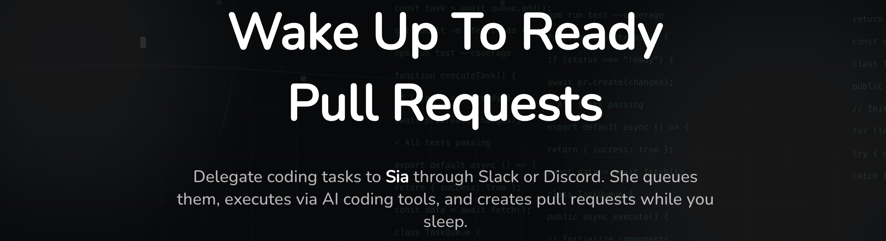

# <a alt="Sia logo" href="https://getpullrequest.com" target="_blank" rel="noreferrer"></a> Sia

<div align="center">
  
</div>

> ⚠️ **Pre-alpha** - This project is under active development and not ready for production use.

Sia is an AI Developer Assistant that automates small, well-defined coding tasks and creates ready-to-review Pull Requests (PRs) while the human developer is offline or sleeping.

## What is Sia?

Sia is your autonomous coding partner that works around the clock. Delegate coding tasks through Slack or Discord, and wake up to ready-to-review pull requests. Sia integrates with AI coding assistants like Claude Agent and Aider to execute tasks, run tests, and create PRs automatically.

## Key Features

### 🤖 Delegate via Chat

Assign tasks through Slack or Discord. Just mention `@sia` with your task and she handles the rest. No need to switch contexts or open additional tools.

### 🔄 Automatic PRs

Sia integrates with Claude Agent and Aider to execute tasks and create pull requests automatically. Each PR is ready for review with proper commits, tests, and documentation.

### ⏰ 24/7 Execution

Tasks run continuously, even when you're offline. Turn idle hours into productive development time. Queue multiple tasks and let Sia work through them systematically.

### 📱 Mobile Control

Review progress, merge PRs, or request rework directly from your phone without opening a laptop. Stay connected to your development workflow from anywhere.

### ⚡ Smart Queue

Prioritize, pause, or cancel tasks from chat. Sia manages execution order intelligently, ensuring important tasks get attention first.

### 📈 Learning Assistant

Over time, Sia learns your working style and suggests priorities to improve code quality. The more you use Sia, the better she understands your preferences.

## Platform Capabilities

### Job Board Dashboard

Visualize your entire workflow at a glance. Track tasks from queue to completion with an intuitive job board. See what Sia is working on, what's in the pipeline, and what's been delivered.

### Recent Activity Feed

Stay updated with real-time activity tracking. Monitor every action Sia takes, from code commits to PR creation. Never miss a beat with detailed activity logs and notifications.

### Agent Management

Configure and manage your AI agents with precision. Set up custom workflows, define task priorities, and optimize agent performance. Full control over your autonomous development team.

### Seamless Integrations

Connect with your favorite tools effortlessly. Slack, Discord, GitHub, and more. Sia fits right into your existing workflow, no disruption required.

## How It Works

1. **Delegate** - Assign a coding task via Slack, Discord, or the web interface
2. **Queue** - Sia adds your task to the smart queue and prioritizes it
3. **Execute** - AI agents work on your task, writing code, running tests, and fixing issues
4. **Review** - Wake up to a ready-to-review pull request with all changes documented
5. **Merge** - Review and merge directly from your phone or desktop

## Architecture

Sia follows a distributed architecture:

- **Web UI & Chat Apps** - User interfaces for Slack, Discord, and web dashboard
- **Backend Server** - Orchestrates job management, agent coordination, and communication
- **AI Agents** - Run on cloud dev machines, executing coding tasks using AI assistants
- **gRPC Communication** - Reliable, bidirectional streaming between backend and agents

For detailed architecture documentation, design specifications, and implementation details, see [`.kiro/specs`](./.kiro/specs/) which contains comprehensive documentation for each component:

- Platform architecture and requirements
- API server design and implementation
- Web frontend specifications
- SIA agent architecture
- CLI application design
- Chat platform integrations
- Temporal task queue system
- Shared models and data structures

## Getting Started

### Prerequisites

- Node.js (v18+ recommended)
- npm
- PostgreSQL (for backend)
- GitHub account (for repository access)

### Quick Start

1. **Clone the repository**

   ```sh
   git clone https://github.com/your-org/oss-sia.git
   cd oss-sia
   ```

2. **Install dependencies**

   ```sh
   npm install
   ```

3. **Set up environment variables**

   ```sh
   cp .env.example .env
   # Edit .env with your configuration
   ```

4. **Run the development servers**

   ```sh
   # Terminal 1: Web UI
   npx nx serve @sia/web

   # Terminal 2: API Server
   npx nx serve @sia/api
   ```

5. **Access the application**
   - Web UI: [http://localhost:3000](http://localhost:3000)
   - API Server: [http://localhost:3001](http://localhost:3001)

> **Note:** After authentication is added, auth may not work on localhost endpoints. Use ngrok for development in that case.

## Documentation

- **[CONTRIBUTING.md](./CONTRIBUTING.md)** - Development setup, coding standards, and contribution guidelines
- **[CHANGELOG.md](./CHANGELOG.md)** - Version history and release notes
- **[AGENTS.md](./AGENTS.md)** - Guidelines for AI agents working with this codebase
- **[`.kiro/specs/`](./.kiro/specs/)** - Detailed architecture specifications, design documents, and requirements for all components

## Learn More

- **Website:** [getpullrequest.com](https://getpullrequest.com)
- **Documentation:** See [CONTRIBUTING.md](./CONTRIBUTING.md) for detailed development documentation

## Status

This project is in **pre-alpha** and under active development. Features and APIs may change without notice. We welcome contributions and feedback!
